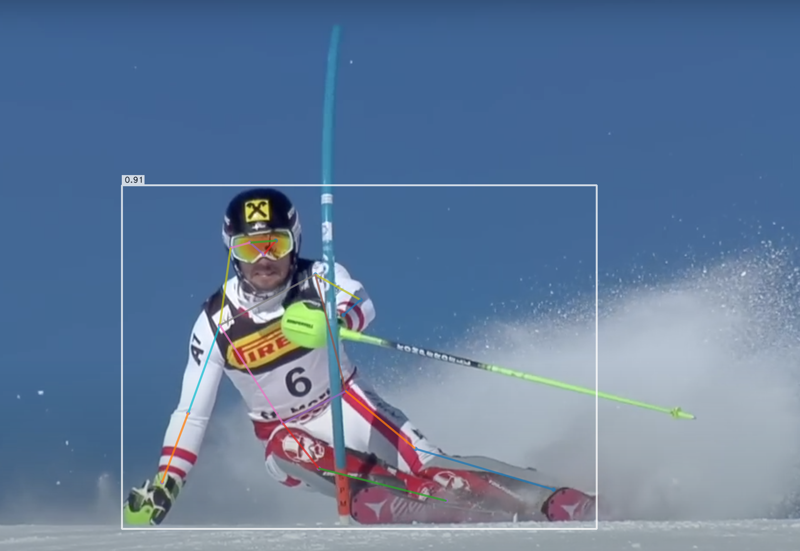

# Ski Racing Video Analysis

I trained an AI model to automatically analyze a skier’s form and objectively quantify their skill through video analysis, providing clear, actionable feedback for performance improvement.




# The Training Process
All coding and model training was done on a Macbook Pro with Apple Silicon.

1. Collected many YouTube slalom ski racing videos and  each skier's slalom points given in the U.S. Ski and Snowboard [website](https://www.usskiandsnowboard.org/public-tools/members) and recorded them into `training/videos.txt`.
2. Downloaded each collected video in `training/download_video.py`.
3. Extracted the pose data of the skier for each video in the form of coordinates with YOLO-NAS-POSE in `training/get_pose_data.py`.
4. Tracked the skier throughout each video with a custom tracking algorithm in `training/track_skier.py`.
5. Normalized all coordinates and combined all data into a single labeled dataset in `training/create_dataset.py`.
6. Trained the model using two Convolutional Neural Network (CNN) layers from Tensorflow's Keras library in `training/train_model.py`


# Installation
This project primarily uses Python for all parts, including both frontend and backend. All code was run with [Python 3.9.6](https://www.python.org/downloads/) to avoid package version conflicts. Before running any code, create a virtual environment:

```sh
python -m venv venv
```

Check if you are using the correct Python version by running:

```sh
python --version
```

It should output "Python 3.9.6". Go into the virtual environment with:

```sh
source venv/bin/activate
```

Then, install all required packages by running

```sh
pip install -r requirements.txt
```

If you are using macOS and want to utilize Mac GPUs for model training, also install [tensorflow-metal](https://developer.apple.com/metal/tensorflow-plugin/).


# Model Testing
To test the model, either use the demo server by running `server/app.py` (recommended) or run `training/test_model.py`. Make sure to go into the directory before running the Python files:

```sh
cd server
python app.py
```
or
```sh
cd training
python test_model.py
```


# Issues
If there are issues with loading pre-trained weights for super-gradients, look at this [GitHub Issue](https://github.com/Deci-AI/super-gradients/issues/2064).